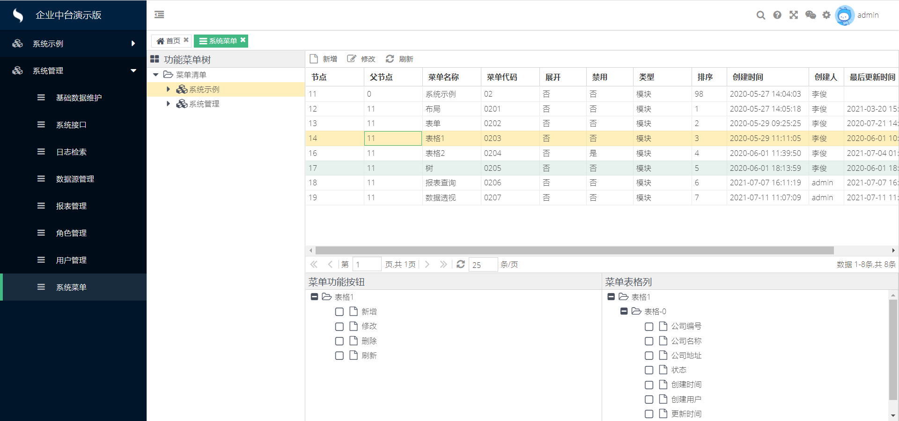
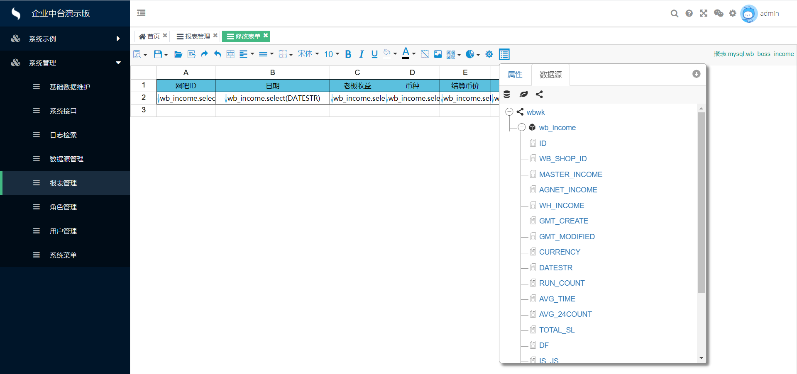
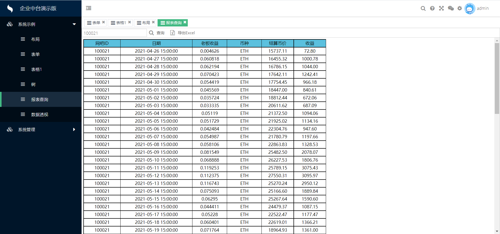
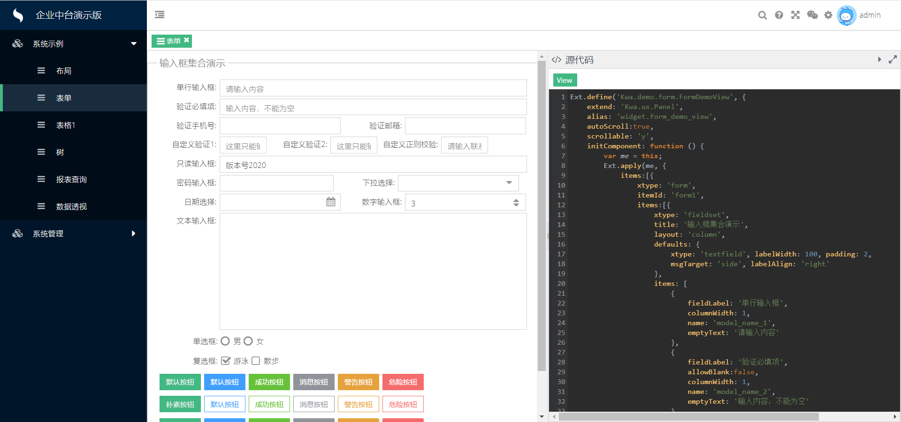
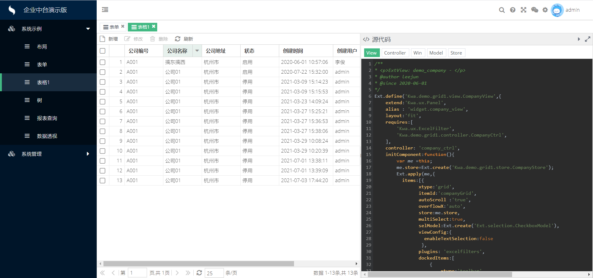
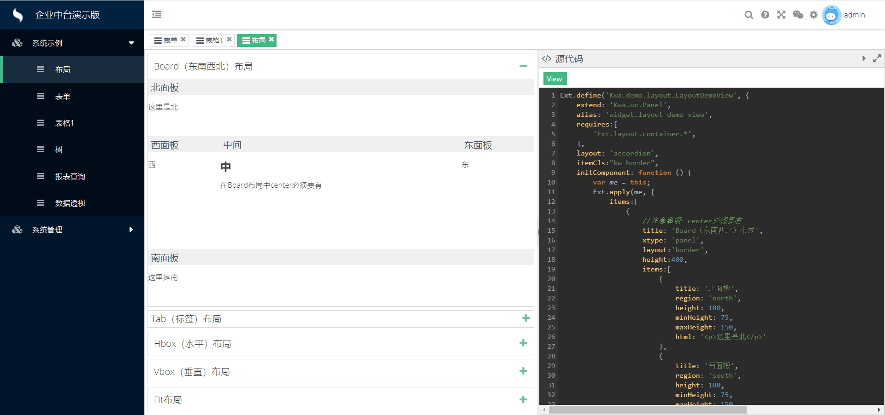
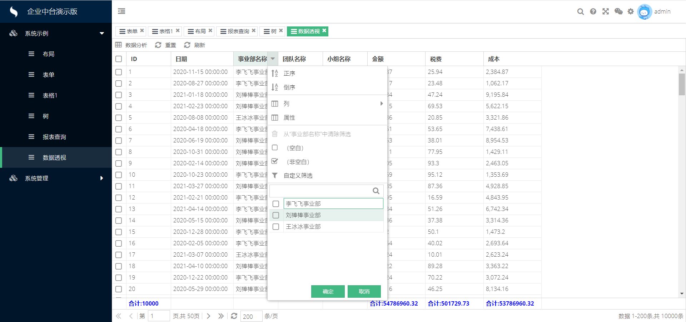
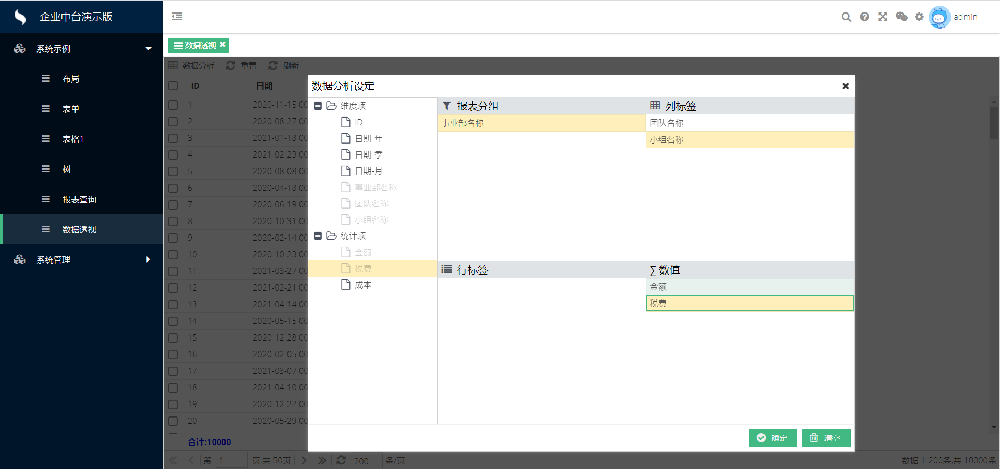
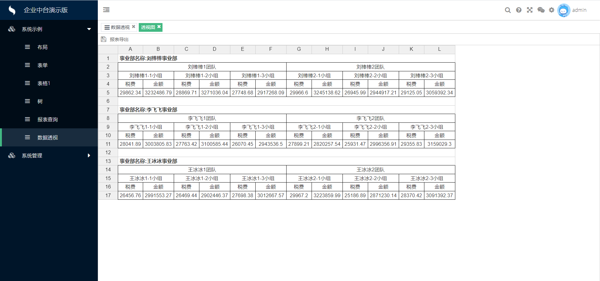
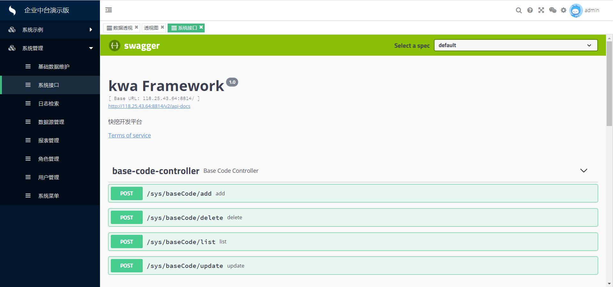

# 快挖企业中台框架
## 主要技术
ExtJs6.2  SpringBoot2.2.5 MybatisPlus Lombok Ureport Swagger

## 项目特色
- 1.灵活配置的权限功能，自动识别页面上的按钮、表格上的列，做到随心配置。

- 2.集成了Ureport插件，可以实现报表配置，报表打印等功能。

- 3.类似Vue Element Admin项目的界面，增加客户第一眼好感度。

- 4.类Excel的表头筛选插件

- 5.任意报表的数据分析

- 6.任意表格右键直接导出excel
- 7.前后端分离，既可以让后端程序员全栈开发，也可以让前端写前端，后端写后端
- 8.代码生成器，根据表名和注释一键生成代码以及swagger文档

## 联系作者
QQ:619344879  
Email:619344879@qq.com 
